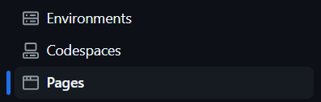
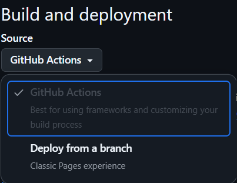
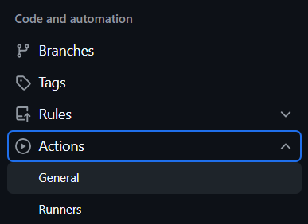
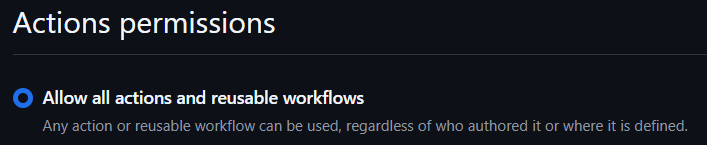

<p align="center">
   
   <h1 align="center">RepoGallery</h1>
   <h3 align="center">Three files &amp; good to go!</h3>
   <p align="center">A beautiful showcase for all your GitHub repos. :art:</p>
</p>

<br>

<p align="center"> <a href="https://anlit75.github.io/RepoGallery">View Live Demo</a>  |  <a href="https://anson-cheng.github.io/RepoGallery-demo-dark">And More</a></p>

<br>

<p align="center"> <a href="README.md">English</a>  |  <a href="docs/README_cn_tw.md">繁體中文</a></p>

<br>

<h2 align="center">✨ Key Advantages ✨</h2>

<p align="center">
  🔹 Easy Setup • ⚡ Automated Deployment <br>
  🎨 Customizable • 💎 Modern Design <br>
  🔄 Upgrades Without Merge Conflicts • 🚀 Live Demo Available
</p>

<br>

## :gear: Prerequisites

A **GitHub account**, and a repository to publish the page from. It can be a brand new empty
repository — you do not need to fork anything.

## :rocket: Quick Start

### Step 1. **Copy the starter files**

Copy the three files in [`examples/starter/`](examples/starter) into your own repository:

```
.github/workflows/gallery.yml   ← runs RepoGallery for you
config.yaml                     ← your settings
assets/custom_image.yaml        ← optional per-project images
```

That is the whole installation. The generator itself stays in this repository and runs from
the `anlit75/RepoGallery@v2` action, so you never hold a copy of it.

### Step 2. **GitHub Settings**

> [!IMPORTANT]\
> These settings **must be configured** via the GitHub Website (GitHub Mobile doesn't support these settings).

#### **A. Configure GitHub Pages**
<details>
<summary>Go to <strong>Settings > Pages</strong></summary>
   
</details>

<details>
<summary>✅ Set <code>Build and deployment</code> <strong>Source</strong> to <strong>GitHub Actions</strong></summary>
   
</details>

#### **B. Enable GitHub Actions**
<details>
<summary>Go to <strong>Settings > Actions > General</strong></summary>
   
</details>

<details>
<summary>✅ Set <code>Action permissions</code> to <strong>Allow all actions and reusable workflows</strong></summary>
   
</details>

### Step 3. **Run it**

Go to the **Actions**  tab,
select **RepoGallery**, and click **Run workflow**.

> [!NOTE]\
> It also runs automatically **every day at UTC 00:00** 🕛, and on **any push to `main`**.

### Step 4. **Personalization (Optional)**

:art: Customize your showcase by editing `config.yaml`. You can change the title, the theme,
which repos are shown, how they are sorted, and more — see the comments in
[**config.yaml**](config.yaml) for every option.

Commit and push; that push redeploys the page.

### Step 5. **View Your Awesome RepoGallery Page**

📌 `https://<your-github-username>.github.io/<your-repo-name>`

## 🔄 How to Upgrade

Nothing to sync, nothing to merge.

Your workflow pins `anlit75/RepoGallery@v2`. The `v2` tag always points at the newest `2.x`
release, so **bug fixes and improvements reach you on the next scheduled run** without you
touching anything.

When a `v3` is released with breaking changes, the release notes will tell you what changed;
upgrade by editing one line:

```diff
-      - uses: anlit75/RepoGallery@v2
+      - uses: anlit75/RepoGallery@v3
```

To pin an exact version instead, use a full tag such as `anlit75/RepoGallery@v2.0.0`.

Upgrading a fork-based install from v1.2.0 or earlier? The steps are in the
[2.0.0 changelog entry](CHANGELOG.md#200---2026-09-18).

## ⚙️ Action Inputs

| Input | Default | Description |
|---|---|---|
| `username` | repository owner | GitHub user whose repos are shown |
| `token` | `github.token` | Token for the GitHub API |
| `config` | `config.yaml` | Path to your config |
| `output` | `public` | Directory the site is written to |
| `assets` | `assets` | Your own files, published alongside the site |
| `python-version` | `3.11` | Python used to run the generator |

## 🛠 How It Works (For the Curious)

`action.yml` runs `scripts/generate_html.py`, which:

1. Reads your `config.yaml` from your repository
2. Fetches your repositories from the GitHub API
3. Renders `templates/v1/` into `public/`

Your workflow then hands `public/` to `actions/deploy-pages`.

### Want to learn more?
Check out the `scripts/`, `templates/` and `tests/` folders.

## ☕ Buy me a coffee
Enjoying this project? Keep me caffeinated so I can keep improving it! <br>
Support my work on Buy Me a Coffee :sparkling_heart:

<a href="https://www.buymeacoffee.com/anlit" target="_blank"></a>

## 📄 License

This project is licensed under the [Apache License 2.0](LICENSE)
